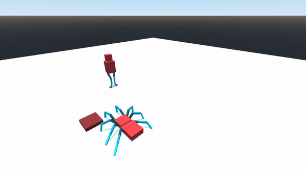

# How we used Procedural Animation

To explore procedural animation, we followed [Codeer's _Unity PROCEDURAL
ANIMATION tutorial (10 steps)_](https://www.youtube.com/watch?v=e6Gjhr1IP6w).
This tutorial gave a high-level overview of the general process Codeer uses
when animating a character.

We implemented the 10 steps in Godot and GDScript to animate a spider, and a
person's legs. Our spider turned out looking sufficiently creepy, and the
person's legs look quite goofy.
