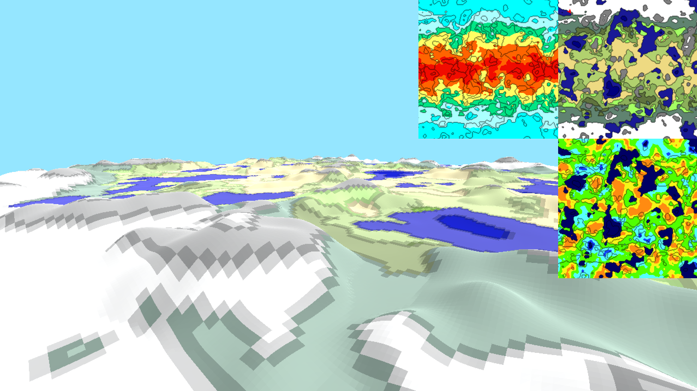
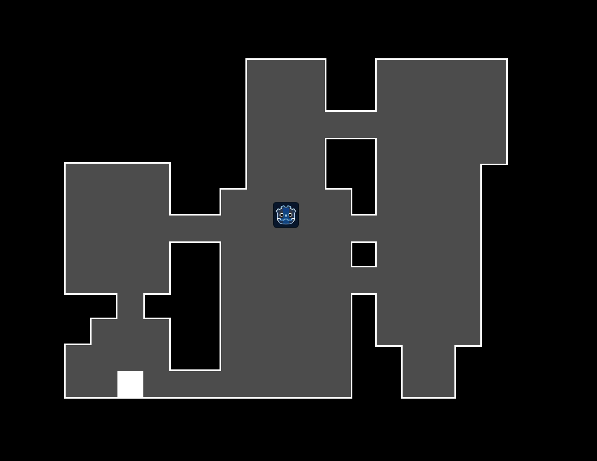

# How we used procedural world generation

In this section, we describe the different procedural world generation
techniques we used to generate worlds.

## Terrain generation

We implemented a procedural terrain generation algorithm in Godot to create
wrapping worlds that consist of landmasses, oceans, lakes, biomes, and
villages.

For our purposes, the process of generating the terrain was split into three parts:

1. Generate a world map
2. Generate a terrain height map based off of the world map
3. Place villages around the terrain

## Generate a world map

To make the world map, we followed [JGallant's _Procedurally Generating
Wrapping World Maps in Unity C#_](http://www.jgallant.com/procedurally-generating-wrapping-world-maps-in-unity-csharp-part-1/)
tutorial. The tutorial is for Unity and C#, but JGalant provides enough
information for us to write the code for Godot in GDScript. Our code can be
found [here](https://github.com/cleap/s21-game-is/tree/main/Procedural%20World%20Demo/WrappingMap).

We followed JGallant's tutorial to generate our height map, moisture map, and
heat map, which we then used to define biomes. The map also wraps on both
axes, so that the left edge lines up with the right edge, and the top edge
lines up with the bottom edge. JGallant's tutorial also goes
deeper, identifying specific lakes in the map and generating rivers based on
gradient descent. We did not follow the tutorial this far, although we would
like to in the future.

## Village and cave generation

We also generated villages, following [GDQuest's dungeon generator tutorial](https://github.com/GDQuest/godot-procedural-generation/tree/master/godot/BasicDungeon/01.Rectangular).
This method is originally meant for generating caves, which we wanted to add
to our mountains. Later down the line, we realized that we could also use
this method to generate villages. Instead of placing a rectangular room, we
place a house that is scaled to the size of the room.

## Combining the two

To combine the two, we used a 'village-plot-request system.' First, we generate
our world terrain. Then, the world generation script asks the terrain for
some number of village plots of a certain size. The terrain searches for valid
spots on the terrain that could fit the plots. Right now, the check just
chooses random spots that are inside the map, but this could be modified to
take terrain height or biome into consideration. The terrain then gives the
world generation script coordinates on the map to place villages. The village
generation script then generates villages of the specified size, then placing
them on the map.
